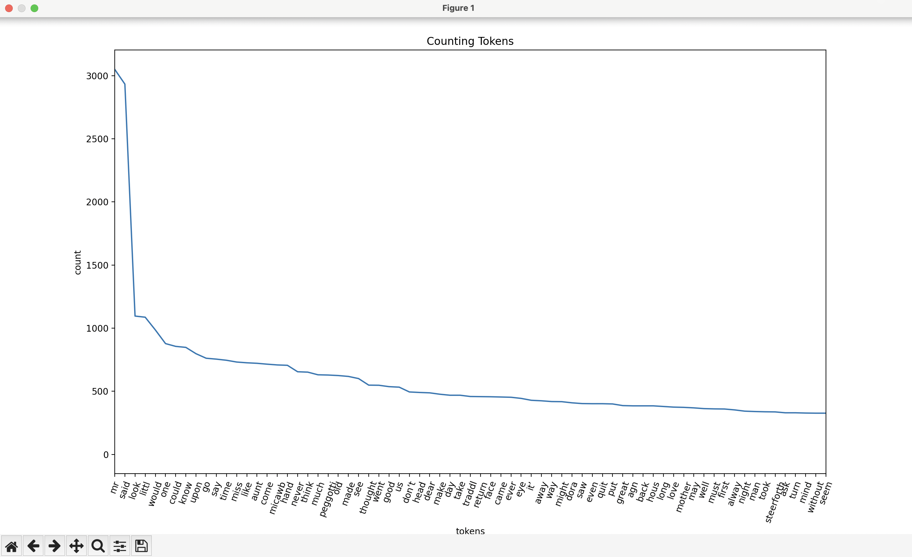

# Counting Tokens

## Requirements
1. Takes input of a text file containing natural language
2. Normalize the text and count the tokens to produce a sorted list
3. Visualize the counts

## Usage
Ensure you activate the virtual environment.  While you are in the root of th project directory, run `source .venv/bin/activate` for mac users.

Use the following command to run the program with stopwords, lowercase, stemmetization, and punctuation removal normalization steps:
python3 tokenization.py davidcopperfield.txt  -w -l -s -p

---- 

usage: tokenization.py filename [-h] [-l] [-s] [-w] [-p] 

positional arguments:
  filename           filename that will be read

options:
  -h, --help         show this help message and exit
  -l, --lower        text normalization step of lowecasing
  -s, --stem         text normalization step of stemming
  -w, --stopwords    text normalization step of stopword removal
  -p, --punctuation  text normalization step of punctuation removal

# Report
## Data
The file I selected is The Project Gutenberg eBook of David Copperfield. No signifcane importance in the file or its content. Having to write the report now, I researched who he is! Turns out David Copperfield is a magician. 

## Methodology
The overall appraoch was 1/ using parser arguments to create options, 2/ leveraging existing libraries to perform normalizations steps such as nltk, 3/ using .split() method to tokenize the data from file, 4/ using a Pandas series which by default sorts and counts elemenets of the list, and 5/ matplotlib to create a line graph.

An additional methodology I used is placing the if statements in a certain order as it would be useful, in the case the user selected multiple options, to remove punctuation before stemmatization or removing stopwords so that string matching can actually occur correctly to either remove them or stem them. 

## Sample Output
(.venv) .... NLP % python3 tokenization.py davidcopperfield.txt  -w -l -s -p
filename: davidcopperfield.txt
lowercase normalization step selected
punctuation removal normalization step selected
stopword removal normalization step selected
[nltk_data] Downloading package stopwords to
[nltk_data]     /Users/farukor/nltk_data...
[nltk_data]   Package stopwords is already up-to-date!
stemming normalization step selected
Highest 10 occurances
mr       3050
said     2933
look     1096
littl    1087
would     986
one       878
could     856
know      848
upon      798
go        762
Name: count, dtype: int64
lowest 10 occurances
stairsth        1
parlour-door    1
bluebottl       1
vindict         1
cloggi          1
lukewarm        1
milk’           1
brandy-merch    1
ago)            1
newslett        1
Name: count, dtype: int64

x-axis ticks have been limtied to 70 for human friendly readability.

## Discussion
Oddly, I notice mr with a very high usage. The remaining are stemmatized, lacking punctuation, and not stopwords. The words are mostly adjectives, if not all. The words that occured the least seem to be unique words and nouns. 1-2 least ocurring words also failed my punctuationt removal test. I do not see any data that shows a list of english words and occurances, but the graphs appears the same as natuarally expected. However, I did run my program without any normalization steps and did notice that stopwords cover the top of the list while the words that are non-stopwords appeared middle to bottom of the list.

I learned quite alot being new to AI/ML. NLP is an unknown territory and the way the professor has taught the theory so far has been understanding. To now practice what I have learned, my understanding has increased in practice. I understand the improtance and impact of the normalization steps. I'm more excited to see how this builds onto things we learn later! I have not used pandas or matplotlib in a while, so it was nice to use it again. nltk is a compeltely new library that I learned. I am used to C++ from undergrad, this was probably the first time I took input of a file using python. Great assignment!